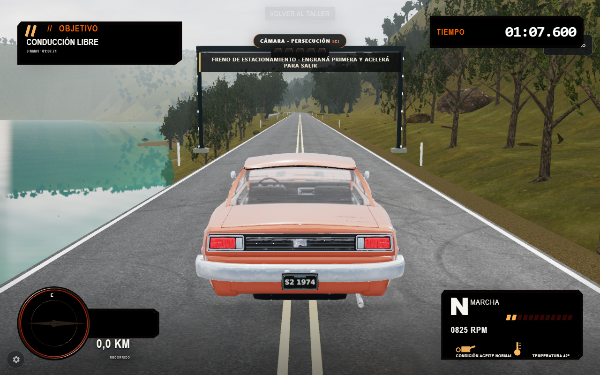

# Realismo y estabilidad de imagen — diagnóstico y diseño

Fecha: 2026-10-04. Mandato: prompt adjunto de 200 apartados, aplicado a Asfalto Nacional v8 existente. Ejecución autónoma solicitada; se implementan los bloques de mayor beneficio comprobable, sin esperar aprobaciones intermedias.

## A–E. Estado, arquitectura, límites, coste y distancia al objetivo

Hechos inspeccionados: Three r180 empaquetado localmente, WebGLRenderer compartido entre taller y carrera, shaders GLSL/onBeforeCompile, Rapier WASM a 120 Hz, estado de carrera independiente del renderer. Hay cinco circuitos, cinco vehículos, HDRI locales, materiales fotográficos, POM, sombras PCF, reflexión planar/probes, GTAO, SSGI espacial, atmósfera estratificada con historia reproyectada, clima, instancias, LOD y gobernador adaptativo. No hay personajes jugables ni ciudad para añadir piel, pelo, multitudes o tráfico por obligación del prompt.

Baseline observado: Chrome 154 headless, ANGLE D3D11, RTX 3060 Ti, 1280×800, DPR 1, perfil gráfico avanzado Equilibrado, Dos Lagos despejado. Taller: rAF p50 16.7 / p95 16.8 ms, 408 llamadas y 1,020,072 triángulos del último cuadro. Carrera detenida inicialmente: rAF p50 16.7 / p95 33.3 ms, GPU p50 12.84 / p95 18.21 ms (EXT_disjoint_timer_query_webgl2), 496 llamadas y 2,775,955 triángulos. Son ventanas locales cortas, no promesas de FPS ni mediciones de VRAM. La preparación auxiliar seguía pendiente al final: se repetirá una ventana estable en la verificación.

Inferencia visual de las capturas inspeccionadas: aliasing en bordes y especulares, microdetalle demasiado persistente al alejarse, vegetación/terreno con resolución y siluetas limitadas. Elevar densidad antes de resolver la estabilidad empeoraría el presupuesto. No se ha comparado con fotografía medida ni se afirma calidad AAA alcanzada.

WebGPU está expuesto por el navegador. Eso no acredita un adaptador ni compatibilidad con los materiales existentes. El build distribuido sólo contiene WebGLRenderer, y los parches GLSL, profundidad logarítmica, espejos y preparación dependen de esa API. Cambiar una clase rompería contratos: se mantiene WebGL2, se detecta el adaptador WebGPU realmente y se informa la limitación. La migración TSL es un bloque futuro separado. No se implementan motion vectors/TAA/upscaling temporal incompletos.

## F–G. Matriz de decisión

Costes relativos previstos, no medidos: B bajo, M medio, A alto. Memoria indica recursos nuevos.

| Técnica / apartados del mandato | Estado y beneficio | GPU | CPU | Memoria | WebGPU | WebGL2 | Prioridad |
|---|---|---|---|---|---|---|---|
| Detección / fallback (2–5, 138–141, 174, 181, 198) | Añadir reporte real; conservar renderer funcional | B | B inicio | B | Detectar adaptador, renderer pendiente | Activo | 1 |
| HDR / color / PBR (13–19, 100, 108) | Conservar flujo lineal y materiales autorizados | existente | existente | existente | migración pendiente | Activo | 1 |
| AA espacial (12) | Añadir FXAA sobre mundo y cockpit antes del LUT; menos bordes dentados | B–M | B | 12 B/píxel | pendiente | Implementar | 1 |
| Mipmaps / anisotropía (20–25, 96–98) | Extender filtrado a Equilibrado 2×, Alto 4×, Cinemática 8×; conservar mapas | B | B refresco | sin texturas nuevas | pendiente | Implementar | 1 |
| Roughness / microdetalle (18–19, 26–29, 158–160) | Atenuar detalle por huella de píxel en todas las calidades; no ruido indiscriminado | B | B | sin recursos nuevos | pendiente | Implementar | 1 |
| Resolución/presets/cadencia (6–8, 122–124, 146–148, 169, 173–176) | Conservar gobernador; reservar nuevo buffer explícitamente | existente | existente | presupuesto explícito | pendiente | Activo | 1 |
| Luz/cielo/sombras/contacto (30–38, 99, 119) | HDRI, sol, PCF y GTAO existentes; añadir oclusión del apoyo de ruedas; CSM/PCSS pendientes | M–A ampliación | B–M | M–A | pendiente | Existente | 2 |
| GI/probes/SSR/reflejos (39–49) | SSGI espacial, probes y planar existentes; SSR jerárquico/clustered no implementados | A ampliación | M | A | pendiente | Parcial | 2 |
| Atmósfera/nubes/clima/agua (50–59, 91–95) | Conservar clima ligado a superficies/adherencia, agua y niebla temporal; froxels/FFT pendientes | existente | existente | existente | pendiente | Parcial | 2 |
| Terreno/vegetación/LOD/culling (60–78, 90, 97, 117–120, 130–131, 154–157, 193) | Conservar instancias, LOD, viento GPU, streaming y frustum; HZB/indirect pendiente | A ampliación | M | M–A | pendiente | Parcial | 2 |
| Workers/WASM/physics (79–82, 121, 125–129, 153, 199) | Conservar; no trasladar DOM ni física por efectos visuales | existente | existente | existente | no requerido | Activo | 1 |
| Personajes/piel/pelo/IK (83–89) | No corresponde a las tareas actuales del producto | — | — | — | — | — | omitir |
| TAA/motion vectors/upscaling (9–11, 105, 112–116, 178–180) | Pendiente: exige identidad móvil, velocity/depth/reactive masks y validación temporal; FXAA no equivale | A | M | A | pendiente | viable futuro | 3 |
| Cámara/lente/post (100–109, 177) | Conservar cámara física, colisión y foto; no añadir bloom/DOF/aberración para ocultar aliasing | M–A ampliación | B | M | pendiente | Existente | 3 |
| Orden/preparación/carga/offline (110–111, 132–145) | Conservar precompilación y recursos locales; no agregar CDN ni PWA innecesaria | existente | existente | sin dependencia runtime | pendiente | Activo | 1 |
| UI/input/fullscreen (149–152) | Conservar teclado/táctil/cámaras/pausa/foco; AA sólo sobre mundo 3D | — | — | — | — | Activo | 1 |
| Validación/debug/polish (161–172, 182–200) | Registrar snapshots, luz/clima, movimiento, GPU/rAF, resize, fallback, recursos y limitaciones | prueba | prueba | evidencia externa | reporte | probar | 1 |

## H. Roadmap y contratos

1. Detección de capacidades: inspección síncrona segura WebGL y probe asíncrono de adaptador WebGPU, sin crear device, sin atribuir VRAM a deviceMemory. Context restore refresca capacidades; dispose impide callbacks tardíos.
2. Filtrado/microdetalle: mismas entidades/materiales/texturas. Anisotropía sólo con mipmaps elegibles; máximo de hardware; varios owners restauran el valor original al liberar. Atenuación derivativa continua en todos los niveles sin historia ni temporizadores. No afecta colisiones.
3. AA de salida: un buffer HDR/depth sin MSAA adicional y un triángulo de pantalla. Dentro de color grading: mundo/cockpit → HDR AA → LUT/tone mapping → pantalla. Taller: HDR AA → tone mapping → pantalla. No aplicar LUT ni tone mapping dos veces. Bajo/Apagado/teléfono/sin HDR usan la ruta anterior sin recursos AA. Preparar los shaders en el destino real; cambios de tamaño, calidad y contexto invalidan buffers; cancelación/desmontaje restaura target, viewport, scissor, clear y counters en finally.
4. Verificar y refinar: pruebas unitarias reales de ownership/fallback/presupuesto; WebGL real con escena diagonal, valores HDR y profundidad, restauración tras error; app completa con cámara en movimiento, seis cielos y lluvia/niebla; medir ventana posterior, revisar imágenes y regresiones.

La mejora entregable no incluye una migración completa a WebGPU, assets AAA nuevos, TAA, CSM, SSR o personajes. Esos bloques necesitan pipelines/recursos distintos y evidencia antes de integración. No se sustituyen por nombres de funciones vacías.

## Refinamiento: contacto del vehículo

Las capturas del recorrido exterior muestran apoyo insuficiente del auto sobre la calzada. Se selecciona una aproximación de oclusión local, no una sombra direccional ni GI física. Contrato: las ruedas con contacto físico y punto/normal finitos generan cuatro manchas suaves alineadas con su plano; sólo si los cuatro contactos comparten superficie, normales y plano, se añade una oclusión tenue del bajo. Sin contactos válidos, no hay parche ni dibujo. Se interpolan posiciones únicamente entre contactos persistentes de la misma rueda; la última observación decide disponibilidad. Límites: cinco parches, un mesh, diez triángulos, sin target/textura/temporizador/raycast adicional. Se alimenta desde el render bridge y no muta snapshots. Referencia espacial: coordenadas físicas mundiales del bridge existente. Se oculta al perder contactos, se libera al desmontar y libera handles antes de recuperar WebGL. Evidencia: planos inclinados, datos ausentes/no finitos, discontinuidad de contacto, interpolación, veinte actualizaciones, disposal/contexto; captura en conducción y coste comparado.

## Entrega y evidencia ejecutada

Se integraron cuatro mejoras: AA espacial sobre el mundo/cockpit y taller; anisotropía por calidad; microdetalle limitado por huella de píxel; oclusión del apoyo real del vehículo. Los datos y la física siguen siendo la fuente de verdad. La detección WebGPU observó un adaptador disponible, pero el backend activo sigue siendo WebGL2 por los contratos GLSL existentes. No se presenta FXAA como acumulación temporal.

Parámetros principales: Equilibrado 2× / Alto 4× / Cinemática 8× de anisotropía con tope del hardware; huella de microdetalle entre 1 y 4 píxeles; FXAA con luminancia perceptual para bordes, subpíxel .65 y umbral relativo .125; AA RGBA16F lineal + profundidad sin MSAA propio, 12 B/píxel adicionales; contacto con hasta cinco parches, diez triángulos, un dibujo, elevación .009 m, opacidad local .38 y del bajo .19. Son parámetros de presentación, no mediciones físicas de radiancia u oclusión. Bajo/Apagado/teléfono/sin HDR omiten el buffer AA.

### Pruebas observadas

- [Suite Node completa](realismo-evidence/full-unit-green.log): **330/330**, cero fallos, skips o cancelaciones. Incluye las regresiones nuevas de capacidades/ownership/budget/preparación y seis de contacto. La comparación de física usa 64 ticks Rapier y 16 de colisión contra el snapshot histórico del propio proyecto. Se repararon diez fixtures previos conservando sus aserciones: HDR declarado explícitamente y nuevo contrato AssetPipeline; se incluyó la referencia histórica en tools/fixtures para eliminar la dependencia de Reports externos en CI.
- [WebGL real](realismo-evidence/aa-gpu.json): **19/19** comprobaciones, glError 0. Diagonal con 0 → 72 píxeles de cobertura intermedia; valores HDR [4,2,1,1] retenidos; LUT con un único tone mapping; profundidad de cockpit independiente; shader de contacto preparado aun oculto, un dibujo adicional y desaparición al perder contacto; restore tras excepción, resize, veinte cambios de calidad, disposal, teléfono/sin HDR y recuperación real con WEBGL_lose_context. Esto no acredita recuperar toda la aplicación durante una compilación pendiente.
- [Aplicación completa](realismo-evidence/verified-browser.json): **23 comprobaciones**. Taller → conducción por teclado real, cambio de cámara, seis HDRI, lluvia/niebla/despejado, veinte cambios rápidos de calidad, 844×390, pausa y foco reducido, Bajo y regreso al taller. Avance observado 8.287 → 105.263 m, velocidad final 10.658 m/s. Cero errores JavaScript, errores de shader/WebGL en consola o peticiones externas. Recursos tras veinte cambios: geometrías 854 → 854, texturas 233 → 223; el descarte de cachés explica la reducción, no una medida de VRAM.
- [Regresión de contratos UI](realismo-evidence/motion-contracts.json): **18 comprobaciones**, interrupciones al inicio/mitad/final, veinte ciclos y veinte montajes/desmontajes, cambio de preferencia durante entrada, fallback sin WAAPI y foco. [Tacto emulado](realismo-evidence/motion-touch.json): **5 comprobaciones**, selección de datos, preparación de salida y regreso al menú. No equivale a conducción sobre un teléfono físico.

Se inspeccionaron realmente las capturas de referencia/final del taller y persecución, conducción, tarde dorada, noche, lluvia, niebla, landscape y regreso al taller. El filtrado suaviza bordes de la carrocería y la oclusión refuerza el apoyo sobre la calzada; persisten siluetas duras de vegetación, reflejos de agua de baja resolución y limitaciones del asset/calibración del taller ya visibles en la referencia. Las capturas prueban esos estados; la ejecución con input prueba el recorrido. No se cuantificó reducción temporal de shimmer con video.

### Medición y presupuesto

Referencia: commit 886a9b4192f3310506b2f49cb0c05cab239499ba, [datos](realismo-evidence/reference-browser.json). Final: [datos](realismo-evidence/verified-browser.json). Entorno: Windows, Node 24.20.0, Playwright 1.62.1, Chrome 154.0.8037.95 headless, ANGLE D3D11, RTX 3060 Ti, 1280×800, DPR 1, Dos Lagos, Chevy 250 SS Serie 2, avanzado Equilibrado, gobernador bloqueado Alto mediante QA. Preparación terminada, 60 frames de asentamiento y 300 intervalos rAF por ventana. GPU usa EXT_disjoint_timer_query_webgl2, no performance.now presentado como GPU. Pruebas gráficas ejecutadas consecutivamente, sin otro ensayo GPU concurrente. Una primera muestra con preparación pendiente y otra contaminada por ensayos simultáneos se descartaron.

| Ventana / métrica | Referencia | Final |
|---|---:|---:|
| Detenido, rAF p50 / p95 / p99 | 33.3 / 33.4 / 50.0 ms | 33.3 / 33.4 / 50.0 ms |
| Detenido, GPU p50 / p95 / p99 | 19.61 / 26.36 / 29.12 ms | 20.10 / 26.50 / 27.75 ms |
| Detenido, trabajo de frame p50 / p95 | 25.9 / 33.4 ms | 26.4 / 33.1 ms |
| Conducción, rAF p50 / p95 / p99 | 16.7 / 33.3 / 33.4 ms | 16.7 / 33.3 / 33.4 ms |
| Conducción, GPU p50 / p95 / p99 | 15.42 / 19.37 / 22.85 ms | 15.32 / 20.81 / 21.67 ms |
| Conducción, trabajo de frame p50 / p95 | 14.1 / 21.4 ms | 14.4 / 21.9 ms |
| Reserva nominal de post a 1280×800 | 77824000 B | 90112000 B |

La ventana detenida corresponde al mismo inicio (8.282 / 8.287 m): p95 GPU varía 0.5%, p95 rAF permanece igual. Criterio local de esta integración: aumento p95 GPU detenido menor a 10%, sin aumento de p95 rAF ni acumulación al ciclar; observado dentro de ese criterio. La meta 60 FPS no se cumple en esa vista detenida. Las ventanas de conducción terminan en posiciones/velocidades diferentes (99.788 m a 10.645 m/s frente a 105.263 m a 10.658 m/s); no permiten atribuir una mejora general al cambio ni aislar su coste.

Trabajo de frame es tiempo de pared del hilo principal que incluye envíos al driver y posibles bloqueos; no es CPU exclusiva. La reserva nominal excluye assets/canvas/overhead del driver, no representa VRAM medida. No se midieron consumo energético, memoria GPU ni clasificación de tareas largas del recorrido 3D. Un solo laboratorio, ventanas cortas y cadencia headless no certifican dispositivos, motores o refresh rates.

### Archivos, licencias y revisión

Nuevos: src/render/render-capabilities.mjs, spatial-antialias.mjs, vehicle-contact-occlusion.mjs y vendor/fxaa-shader-factory.mjs / FXAAShader.js; tools/photoreal-policy.test.mjs, vehicle-contact-occlusion.test.mjs, spatial-antialias.gpu.mjs, photoreal-browser.mjs, fixtures históricos y este informe/evidencia. Integración: advanced-graphics.mjs, advanced-materials.mjs, texture-filtering.mjs, render-budget.mjs, screen-space-lighting.mjs, race-color-grade.mjs, module-02.mjs; callers y entrypoints actualizados con hashes de contenido. README, vendor/README y release.json registran entrega e integridad. El listado exacto está en el diff del commit y el inventario release.json.

Se conserva Three r180 local; FXAAShader procede del upstream MIT, con atribución y licencia junto al archivo. No se añadió paquete, CDN, fuente, modelo ni petición runtime externa. Hay un shader upstream nuevo (~7 KB) y su adaptador, código de render/pruebas y evidencia; el incremento y total exactos quedan registrados en el inventario de publicación verificado. Playwright/Chrome son herramientas de prueba, no dependencias runtime.

Revisión independiente estática: corrigió separación de los registros compartidos de preparación, recursos de vehículos, matrices y curvatura por URLs, doble pase transparente y omisión del shader oculto. Todas tienen regresión RED→GREEN. El ensayo real encontró limpieza de handles obsoletos en context restore, corregida y repetida con cero errores. No se extrapola esa revisión a conformidad normativa ni a todos los pases originales.

### Ejecutar y límites de entrega

Desde la raíz: node server.mjs; abrir la URL indicada o el launcher INICIAR_JUEGO.bat. En Windows PowerShell: node --test (Get-ChildItem tools/*.test.mjs).FullName; integridad: node tools/verify-v8-release.mjs. Con Playwright instalado localmente, o PLAYWRIGHT_PACKAGE_JSON apuntando a su package.json y CHROME_PATH al navegador: node tools/spatial-antialias.gpu.mjs y node tools/photoreal-browser.mjs verified. PHOTOREAL_REPORT_DIR cambia la carpeta de evidencia. Los scripts no alteran la aplicación de producción.

Pendientes: Safari/Firefox/WebKit, GPUs/móviles físicos, modo offline con service worker (no se añadió), zoom/lector de pantalla, todos los vehículos/circuitos y competencia completa, recuperación del juego entero durante compilación/captura pendiente, cuantificación temporal de shimmer. El catálogo/LOD de vegetación, terreno y reflejos mantiene las limitaciones observadas. No se alcanzó ni se declara fotorealismo AAA: WebGPU/TSL, TAA con velocity/reactive masks, CSM/SSR y recursos de mayor calidad necesitan bloques comprobables propios. La sustitución entregada para estabilidad es espacial y conserva el renderer y la interactividad existentes.
